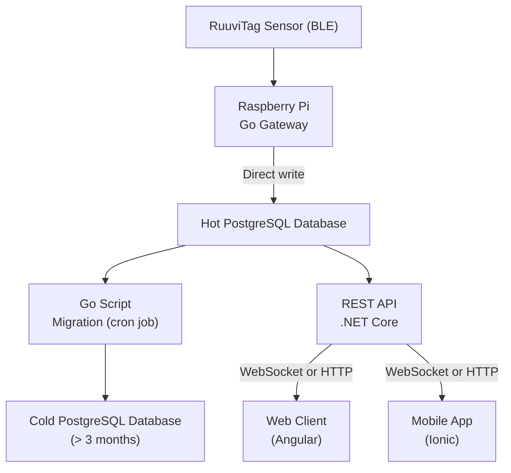

# 🌱 Agribus – IoT Platform for Smart Greenhouse Monitoring

## 📌 Project Goal

**Agribus** is a platform dedicated to the **intelligent monitoring** of physical conditions in **private greenhouses**.

It enables:

- Collection of data from physical sensors (temperature, humidity, presence…)
- Application of user-defined rules (thresholds, alerts)
- Multi-channel alert management (email, messaging platforms)
- Real-time visualization and historical analysis through interactive widgets
- Smart recommendations using artificial intelligence (AI)

## 💿 Installation

## 🧱 Global Architecture

---

## 🔧 Technical Details

- **Sensors**: RuuviTag (BLE) measuring temperature, humidity, and pressure.
- **Gateway (Go on Raspberry Pi)**:
  - Only accept connections from authorized sensors
  - Scans BLE frames from RuuviTag sensors
  - Parses and structures the sensor data
  - Sends data (TODO):
    - Either via **secure REST API** (for validation and business logic)
    - Or **directly to the PostgreSQL hot database** (for performance and simplicity)
- **Backend API**: .NET Core (C#)
  - User management and authentication
  - Rule engine implementation
  - Exposes secure REST APIs and real-time WebSocket endpoints
- **PostgreSQL Databases**:
  - **Hot DB**: Stores recent data (less than 3 months)
  - **Cold DB**: Stores archived data (older than 3 months)
  - A **Go script**, scheduled via `cron`, handles data migration periodically
- **Frontend Web**: Angular
  - Real-time dashboard with interactive widgets
  - Historical chart visualization
- **Mobile App**: Angular + Ionic
  - Same features as the web interface, with responsive mobile UI
  - Optional push notifications

---

## 📄 License

Project licensed under the **MIT License**. See the `LICENSE` file for details.
